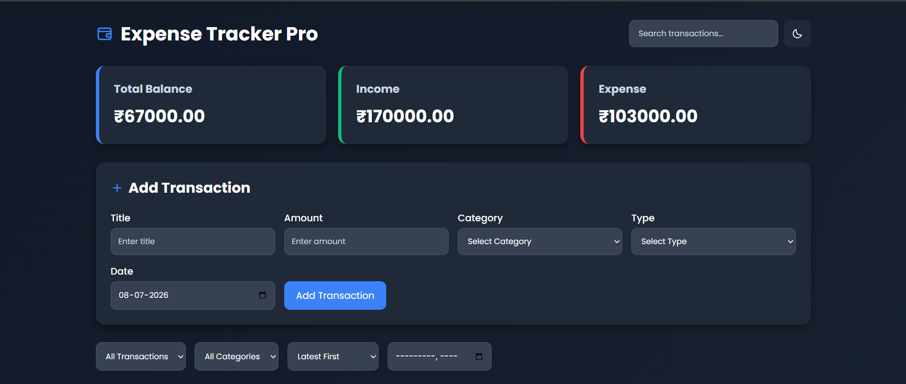
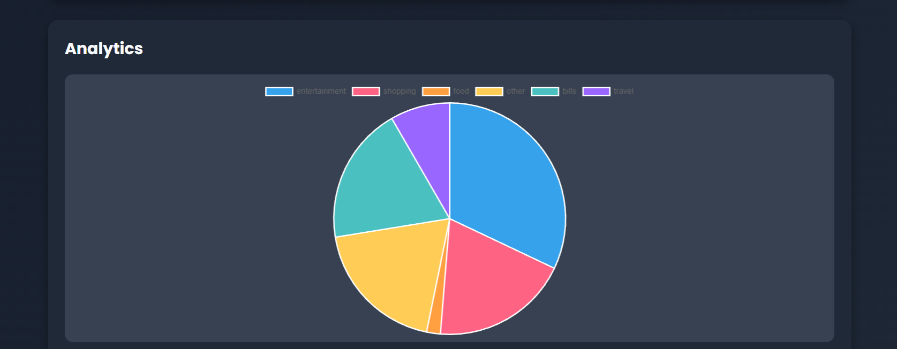
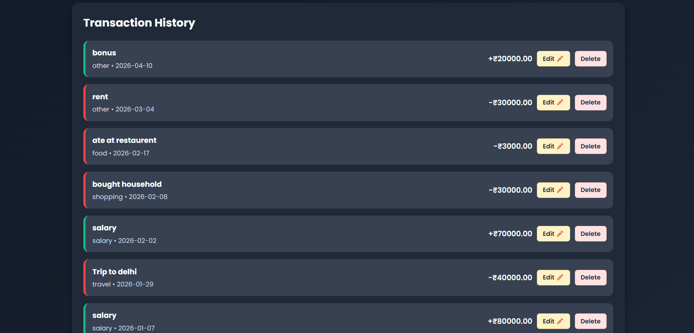
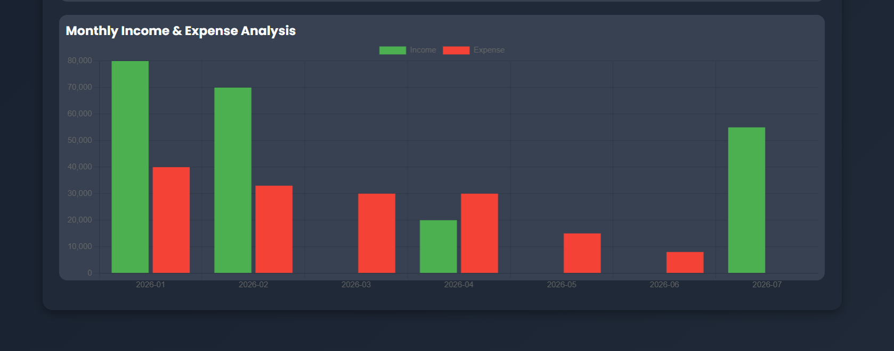

# 💰 Expense Tracker Pro

A modern and responsive **Expense Tracker** web application built using **HTML, CSS, and JavaScript**. Track your income and expenses, monitor your financial health with interactive charts, and manage transactions efficiently using Local Storage.

---

## 📸 Preview

| Dashboard | Analytics |
|-----------|-----------|
|  |  |

---

## 🚀 Features

- 💰 Add Income & Expense Transactions
- ✏️ Edit Transactions
- 🗑️ Delete Transactions
- 📋 Transaction History
- 🔍 Search Transactions
- 🎯 Filter by Type (Income / Expense)
- 📂 Filter by Category
- 📅 Filter by Month
- ↕️ Sort by Latest, Oldest, Highest & Lowest Amount
- 📊 Real-time Balance, Income & Expense Summary
- 📈 Monthly Income & Expense Analytics
- 🥧 Category-wise Expense Pie Chart
- 💾 Data Persistence using Local Storage
- 📱 Fully Responsive Design
- ⚡ Smooth User Interface & Animations

---
## 🌐 Live Demo

🔗 **Live Website:** https://sainath-expense-tracker-pro.netlify.app/


## 🛠️ Technologies Used

- HTML5
- CSS3
- JavaScript (ES6)
- Chart.js
- Local Storage

---

## 📂 Project Structure

```text
Expense-Tracker-Pro/
│
├── index.html
├── style.css
├── script.js
├── assets/
│   └── screenshots/
│       ├── dashboard.png
│       ├── transaction-history.png
│       ├── analytics.png
│       └── piechart.png
└── README.md
```

---

## ⚙️ Installation

Clone the repository

```bash
https://github.com/sairaj-086/Expense-Tracker-Pro
```

Navigate to the project folder

```bash
cd Expense-Tracker-Pro
```

Open `index.html` in your preferred web browser.

---

## 📊 Dashboard Overview

The application provides:

- 💰 Current Balance
- 📈 Total Income
- 📉 Total Expenses
- 📋 Transaction History
- 📊 Monthly Analytics
- 🥧 Expense Distribution by Category

---

## 📸 Screenshots

### 🏠 Dashboard


---

### 📋 Transaction History



---

### 📈 Analytics


---

### 🥧 Expense Category Pie Chart



---

## 🎯 Future Improvements

- 🌙 Dark Mode
- 📤 Export Transactions to CSV
- 📥 Import Transactions from CSV
- ☁️ Cloud Database Integration
- 🔐 User Authentication
- 📱 Progressive Web App (PWA)
- 💱 Multi-Currency Support
- 🎯 Monthly Budget Goals
- 📊 Advanced Financial Reports

---

## 📄 License

This project is created for learning, practice, and portfolio purposes.

---

## 👨‍💻 Author

**Sainath Uppalwar**

GitHub: https://github.com/sairaj-086

LinkedIn: *(Add your LinkedIn profile if available)*

---

⭐ If you found this project useful, consider giving it a **Star** on GitHub!
